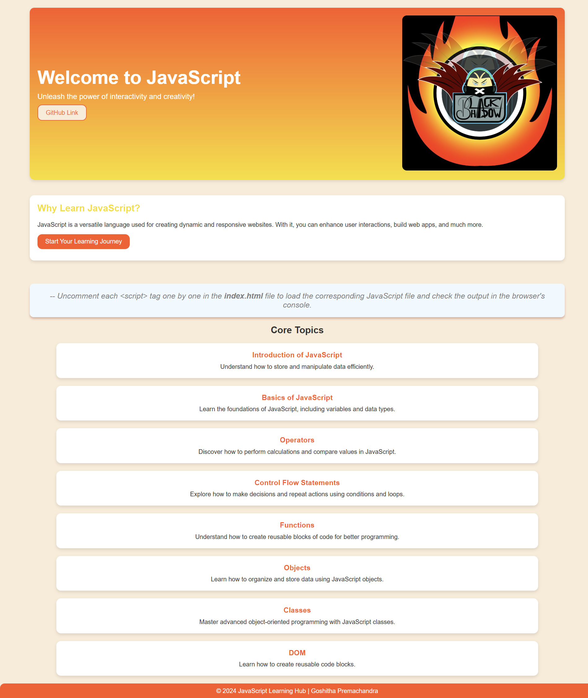
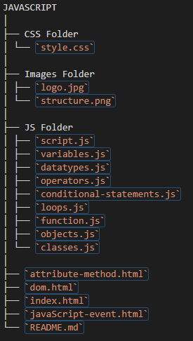

# JavaScript Tutorials

Welcome to **JavaScript Tutorials**, a comprehensive learning hub designed to help you master JavaScript from the basics to advanced concepts. This project demonstrates various web development techniques, including DOM manipulation, event handling, and interactivity.

## Project Overview

This repository provides an interactive interface and structured learning modules to guide users through core JavaScript topics. Whether you're a beginner or looking to enhance your skills, this project has you covered.




## Features

- **User-Friendly Interface**:
  - A visually appealing and intuitive design.
  - Interactive cards for navigating core topics.

- **Core Topics**:
  - **Introduction of JavaScript**: Understand how to store and manipulate data efficiently.
  - **Basics of JavaScript**: Learn the foundations, including variables and data types.
  - **Operators**: Discover how to perform calculations and compare values.
  - **Control Flow Statements**: Explore conditions and loops for decision-making and repetition.
  - **Functions**: Create reusable blocks of code.
  - **Objects**: Organize and store data efficiently.
  - **Classes**: Master object-oriented programming concepts.
  - **DOM Manipulation**: Learn how to interact with the Document Object Model for dynamic content.

- **Interactive Buttons**:
  - Buttons that provide navigation to specific sections or external resources.

- **GitHub Link**:
  - Quick access to the repository for contributors or learners.

## Project Structure



<!--

JAVASCRIPT
│
├── CSS Folder
│ └── `style.css` 
│
├── Images Folder
│ ├── `logo.jpg`
│ └── `structure.png`
│
├── JS Folder
│ ├── `script.js` 
│ ├── `variables.js`
│ ├── `datatypes.js` 
│ ├── `operators.js` 
│ ├── `conditional-statements.js` 
│ ├── `loops.js` 
│ ├── `function.js` 
│ ├── `objects.js` 
│ └── `classes.js` 
│ 
├── `attribute-method.html`
├── `dom.html` 
├── `index.html`
├── `javaScript-event.html`
└── `README.md` 

-->  

## How to Run

1. Clone this repository:
   ```bash
   git clone https://github.com/stgoshitha/JavaScript-Tutorials.git
2. Open the project folder in Visual Studio Code (VS Code).
3. Open the `index.html` file in a web browser to view the project.
